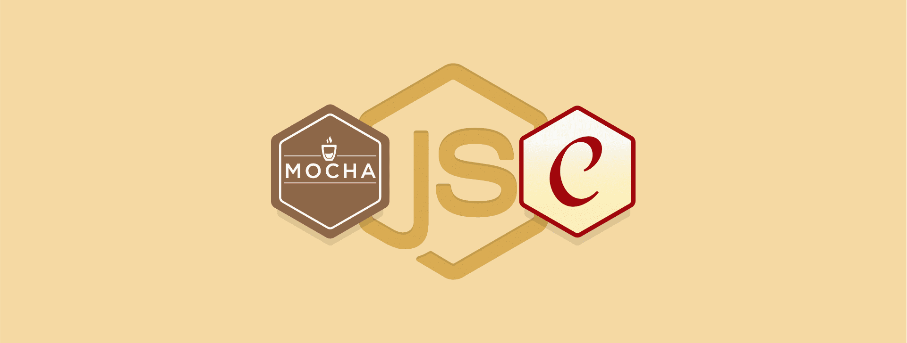

# Testing Node.js with Mocha

### Testing with Mocha  
  
- Mocha as a test runner
- Dig into the mechanics
- "describes" and "it"s
- The whole life cycle
- Managing what tests execute like "only" or "skip"

### BDD Style Assertions with Chai

- Chai provides two different options of natural assertion:
    - Expect
    - Should
- Verifing objects can be achived with the "deep" attribute.

### Spy, Stubs and Mocks with Sinon

Sinon.stub is going to take a function and replace it with a own one.
This allows to do real unit testing.

